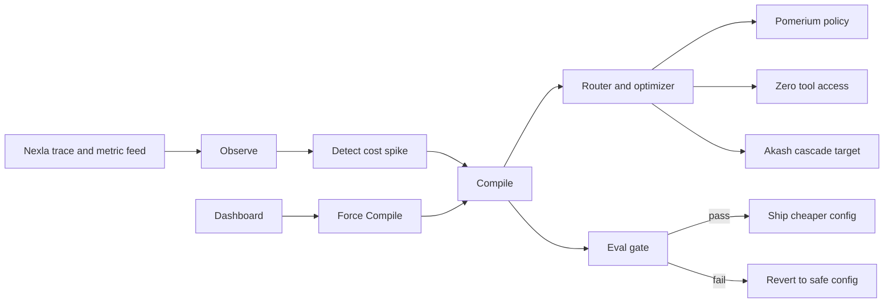

# OptiLoop

> OptiLoop compiles any agent loop across providers under your governance policy, and proves it did not regress.

## Status

This repository is in the planned-build stage. This README describes the confirmed OptiLoop design and submission materials; it does not claim that a recording, public repository, or dashboard screenshots exist yet.

## What it does

OptiLoop is a correctness-preserving optimizer for agent loops. Its autonomous controller observes incoming agent traces and cost metrics, detects an expensive loop, compiles a lower-cost configuration, and runs an eval gate before shipping it. A passing candidate is shipped automatically; a failing candidate is reverted to the known-safe configuration. The optimizer combines model cascading with simple prompt compression, while governance policy constrains which steps may use external or open models.

## Architecture



The dashboard is intended to show the loop already running autonomously, with a controlled **Force Compile** action available for a live demo.

## Sponsor tools and platform hooks

- **Zero.xyz:** the agent's act step runs tools through Zero's no-key access layer; this is part of the compiled loop, not a cosmetic integration.
- **Pomerium:** policy-gated routing prevents PII-touching steps from cascading to external or open models unless authorized. The planned prototype evaluates this policy locally.
- **Nexla:** the observe step consumes a real-time trace and metric feed to identify expensive agent activity.
- **Local eval gate:** deterministic fixture-backed checks decide whether the optimized loop ships or reverts.
- **OpenAI:** the frontier-model provider for protected steps.
- **Akash:** the planned low-cost, cross-provider cascade target for eligible steps.
- **Cursor:** the input format is a Cursor-Composer-style loop JSON, so an existing agent loop can be compiled rather than rewritten.

## Planned demo path

The intended before/after story is a baseline cost of **$1.84** and an optimized cost of approximately **$0.22**, subject to CP7 integration verification. During compilation, eligible steps cascade to Akash, the PII step remains on the safe frontier model due to Pomerium policy, and tool calls are traced through Zero. The eval gate then either ships the cheaper configuration or reverts it automatically.

## Run locally

After the CP1–CP7 implementation checkpoints are complete, start the planned prototype with:

```bash
# Terminal 1: backend
cd optiloop/server
pip install -r requirements.txt
uvicorn main:app --reload --port 8000

# Terminal 2: frontend
cd optiloop/web
npm install
npm run dev
```

Then open the frontend at `http://localhost:5173`. CP7 should verify the autonomous state feed, Force Compile flow, policy block, Zero trace, Akash routing, passing eval shipment, and failing-eval reversion before recording a demo.

## Project layout

```text
optiloop/
  server/       Single-file FastAPI demo API
  web/          Vite React dashboard
  fixtures/     Deterministic loop, trace, pricing, policy, and eval data
  schemas.md    Shared JSON and API contracts
```

## Submission checklist

- [ ] Complete CP7 end-to-end verification and record the known-good demo path.
- [ ] Record the three-minute demo using `DEMO_SCRIPT.md`.
- [ ] Add verified dashboard media if available.
- [ ] Make the repository public and verify it while logged out.
- [ ] Submit the repository and recording links to Devpost.
