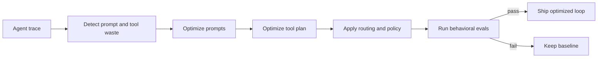

# DWOA

> DWOA removes wasted prompt tokens and tool calls, then proves the optimized agent still works.

## Status

The repository contains a fixture-backed prototype dashboard and controller. Model routing, cost
estimation, and a local demo gate exist. The core prompt rewriter and tool-plan optimizer described
in the plan are not complete yet.

## Problem

Agent loops accumulate repeated instructions, oversized context, duplicate reads, and unnecessary
tool calls. Existing model routers can choose a cheaper model, but they do not optimize the whole
loop. DWOA compiles prompts and tool plans, evaluates the candidate against the original
behavior, and ships only a passing optimization.

## What DWOA optimizes

- **Prompts:** deduplicate instructions and context, remove irrelevant history, and preserve safety,
  policy, task, and output-format requirements.
- **Tools:** merge identical read-only calls, reuse valid results within a run, and remove unused
  results.
- **Never optimized away:** writes, payments, deployments, ticket updates, and other side effects.
- **Supporting infrastructure:** model routing, pricing, and governance constraints.

## Architecture



## Use cases

The initial use cases are customer support, repository coding, and invoice processing. Their
baseline waste, safety constraints, and eval gates are defined in [`USE_CASES.md`](USE_CASES.md).

## Demo contract

The dashboard must show measured values rather than fixed marketing numbers:

- prompt tokens before and after;
- read-only tool calls removed or merged;
- side-effecting calls preserved;
- estimated latency and cost;
- eval results and the ship-or-rollback decision.

The live view plots quality score for every iteration. Each point exposes the exact prompt, tool,
metric, and gate changes. A Replay tab loads immutable historical snapshots and animates their
recorded phases without rerunning tools or repeating side effects.

External services may be represented by fixtures during the demo, but the UI and narration must
label fixture-backed behavior accurately.

## Run locally

```bash
# Terminal 1
cd optiloop/server
pip install -r requirements.txt
uvicorn main:app --reload --port 8000

# Terminal 2
cd optiloop/web
npm install
npm run dev
```

Open `http://localhost:5173`.

## Project layout

```text
optiloop/
  server/       FastAPI prototype
  web/          Vite React dashboard
  fixtures/     Deterministic loop, trace, pricing, policy, and eval data
  schemas.md    Shared JSON contracts
plan/           Implementation checkpoints
```

## Before claiming completion

- Implement content-based prompt transformations instead of a fixed token multiplier.
- Implement auditable tool-plan optimization with side-effect protection.
- Run baseline and optimized loops through the same behavioral evals.
- Verify the end-to-end demo path and replace placeholder metrics with measured results.
